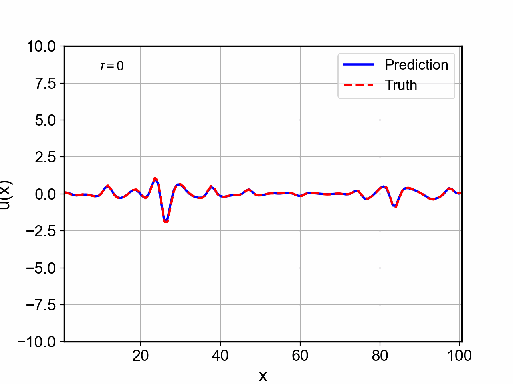
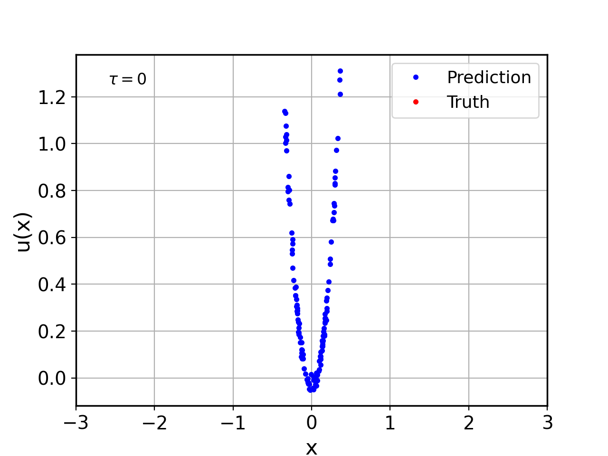

# Gray-Box Neural Network for the Kuramoto-Sivashinsky Equation

A gray-box machine learning model for the 1D Kuramoto-Sivashinsky (KS) equation. The known linear physics is embedded directly into the time-stepper (ETD-RK4 in Fourier space), while a **Fourier Neural Operator (FNO)** learns the unknown nonlinear term from training data: stochastic trajectories driven by Gaussian or Ornstein-Uhlenbeck noise.

## Background

The 1D KS equation on a periodic domain is:

$$u_t + u_{xx} + u_{xxxx} + \tfrac{1}{2}(u^2)_x = 0$$

The linear terms $u_{xx} + u_{xxxx}$ are solved exactly in Fourier space via ETD-RK4. The nonlinear convection term $\frac{1}{2}(u^2)_x$ is treated as **unknown** and approximated by the FNO, which receives a window of past states as input. This structure enforces physical consistency while keeping the learned component compact.

## Training data

The spectral solver (`training_data/spectral_periodic_kurasiv_1d_torch.py`) integrates the KS equation at $N = 128$ modes on the domain $[0, 32\pi]$ with $\Delta t = 0.25$ using ETD-RK4.  Stochastic variants add either white Gaussian noise or colored Ornstein-Uhlenbeck noise at each step.

| Script | Noise type |
|---|---|
| `spectral_periodic_kurasiv_1d_torch.py` | None (deterministic) |
| `spectral_periodic_kurasiv_1d_torch_SDE.py` | Additive Gaussian white noise |
| `spectral_periodic_kurasiv_1d_torch_SDE_OU_noise.py` | Ornstein-Uhlenbeck colored noise |

**Example: stochastic KS trajectory ($\sigma = 0.05$)**


*Space-time evolution of $u(x,t)$ under additive Gaussian noise with $\sigma = 0.05$.*

## Model architecture

`lib/KSGrayBox.py` defines the full model:

- **`SingleStep`** — one ETD-RK4 step in Fourier space, calling the FNO for the nonlinear term at each Runge-Kutta stage.
- **`MultiStep`** — unrolls `SingleStep` over an arbitrary number of steps, collecting outputs every integer time unit.
- **`KSGrayBox`** — top-level wrapper; takes an initial condition in Fourier space and the number of output time steps.

The FNO (`ODEMLPFunc_FNO`) receives a window of `n_embeddings = 8` past states, compressed via a truncated SVD before being passed to the operator.

## Loss function

Training minimizes a weighted MSE on both the solution $u$ and its time derivative $\dot{u}$ (computed via natural cubic spline using [`torchcubicspline`](https://github.com/patrick-kidger/torchcubicspline) by Patrick Kidger), plus an optional L1 regularizer on the FNO output coefficients (`lib/KSLossFunc.py`, class `KSL1RegRealDtMeanSquaredError`).

## Usage

### 1. Generate training data

```bash
cd training_data
# Deterministic trajectory
python spectral_periodic_kurasiv_1d_torch.py

# Stochastic — Gaussian noise (set sigma and tmax inside the script)
python spectral_periodic_kurasiv_1d_torch_SDE.py

# Stochastic — OU noise
python spectral_periodic_kurasiv_1d_torch_SDE_OU_noise.py
```

Generated `.pt` files are saved to `training_data/`.

### 2. Train the model

Edit the data file paths and hyperparameters at the top of `train.py`, then:

```bash
python train.py
```

Key hyperparameters in `train.py`:

| Parameter | Default | Description |
|---|---|---|
| `sigma` | `0.05` | Noise level of training data |
| `n_embeddings` | `8` | Number of past states fed to FNO |
| `n_modes` | `5` | FNO spectral modes |
| `lr` | `1e-2` | Adam learning rate |
| `lam` | `0` | L1 regularization weight |
| `EPOCHS` | `2000` | Max training epochs |
| `PATIENCE` | `150` | Early stopping patience |

The best checkpoint is saved to `models/ks_model_v3.pth`.

### 3. Run and visualize

```bash
python run_model.py
```

This loads the trained model, runs it on held-out test trajectories, and saves animated comparisons to `figures/`.

## Results

**Predicted vs. true solution $u(x,t)$ and time derivative $\dot{u}$**



*Comparison of predicted (blue) and true (orange) time derivative $\dot{u}(x,t)$ on test trajectories.*

**Learned nonlinear term $N(u)$**



*The FNO's learned approximation of the nonlinear convection $-\frac{1}{2}(u^2)_x$ plotted against the solution amplitude.*

## Dependencies

```
torch >= 2.11
neuralop >= 2.0
torchcubicspline >= 0.0.3
numpy >= 1.26
matplotlib >= 3.8
```

Install with:

```bash
pip install torch neuralop torchcubicspline numpy matplotlib
```

## References

- Kassam, A.-K. & Trefethen, L. N. (2005). Fourth-order time-stepping for stiff PDEs. *SIAM Journal on Scientific Computing*, 26(4), 1214–1233. https://doi.org/10.1137/S1064827502410633
- Kidger, P. (2021). torchcubicspline. https://github.com/patrick-kidger/torchcubicspline

## Repository structure

```
.
├── lib/
│   ├── KSGrayBox.py        # Model definition (FNO + ETD-RK4)
│   ├── KSDataset.py        # Dataset and data segmentation
│   ├── KSLossFunc.py       # Loss functions
│   └── LegPoly.py          # Legendre polynomial activations
├── training_data/
│   ├── spectral_periodic_kurasiv_1d_torch.py           # Deterministic solver
│   ├── spectral_periodic_kurasiv_1d_torch_SDE.py       # Gaussian noise solver
│   └── spectral_periodic_kurasiv_1d_torch_SDE_OU_noise.py  # OU noise solver
├── figures/                # Output animations
├── models/                 # Saved checkpoints
├── util/
│   └── utils.py            # Data segmentation and animation helpers
├── train.py                # Training script
└── run_model.py            # Inference and visualization
```
